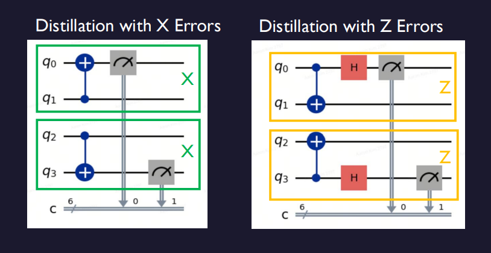
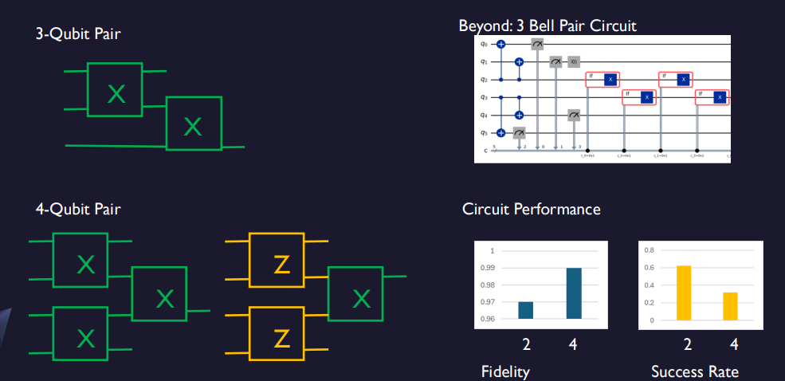
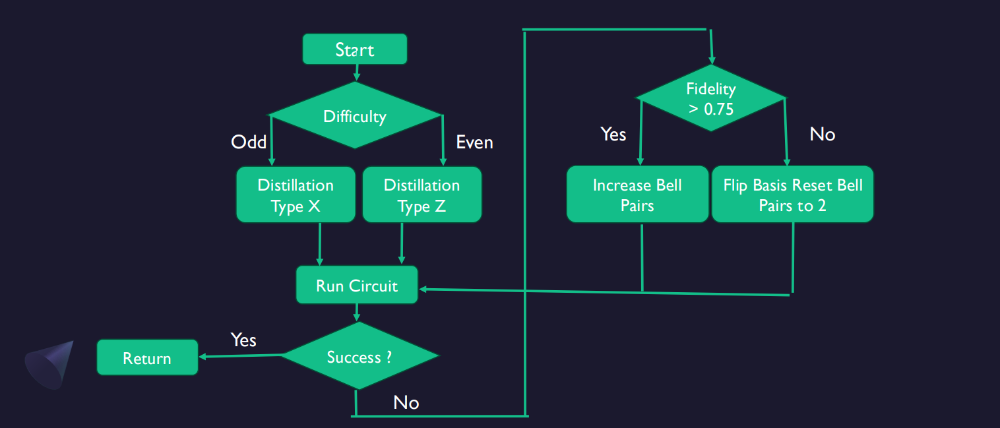
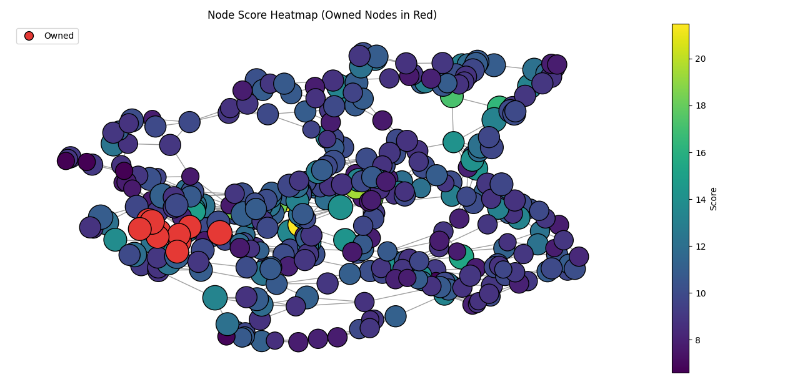

# **Team Blizzards** -  IonQ Challenge - MIT iQuHack 2026

This repository contains our submission for the **IonQ Challenge at MIT iQuHack 2026**

The challenge consists of a competitive, graph-based game where players attempt to claim edges by performing **quantum entanglement distillation** under limited budget, probabilistic outcomes, and restricted quantum operations (local quantum + global classical).

Our solution combines:
- Modular quantum circuit design for entanglement distillation  
- Adaptive circuit selection based on observed outcomes  
- A classical strategy layer for node and edge selection under uncertainty  

---

## Team Members
- **Ismael Gonzalez**
- **Shane Tendo**
- **Lukas Rapp**
- **Félix Wilhelmy**
- **Aaron Kim**

---

## Project Overview

At a high level, the game requires solving two tightly coupled problems:

1. **How to distill entanglement efficiently** given noisy Bell pairs and strict operational constraints
2. **Which edge to attempt next** to maximize long-term reward while avoiding early elimination due to budget exhaustion

We address this by:
- Designing **reusable, modular distillation circuits** that can scale in strength
- Using **feedback from previous attempts** (fidelity, success/failure) to adapt circuits
- Ranking nodes and edges using a **value-based heuristic** combined with learned success probabilities
- Enforcing **budget safeguards** to ensure survivability over the full game

---

## Strategy Overview

Our strategy operates as a closed feedback loop:

1. Rank nodes and edges using a classical scoring heuristic
2. Select a promising edge that can be claimed within a safe budget margin
3. Choose and execute an adaptive distillation circuit
4. Learn from the outcome (success, fidelity, threshold)
5. Update future decisions accordingly

The classical and quantum components are designed to reinforce each other rather than operate independently.

---

## Modular Entanglement Distillation

### Basic Distillation Blocks (X and Z Errors)

The challenge restricts players to **local quantum operations** combined with **global classical communication**.  
Our distillation circuits respect this by using CNOT-based parity checks performed locally on Bell pairs.

We implement two core distillation primitives:
- **X-basis distillation** (targeting bit-flip–type errors)
- **Z-basis distillation** (targeting phase-flip–type errors)

Each block:
- Measures Bell pair parity locally
- Uses classical bit logic to validate correctness
- Discards invalid pairs via a flag bit

---

### Scaling via Modular Composition

Rather than designing monolithic circuits, we build **larger, stronger circuits by composing small reusable blocks**.

This allows us to:
- Start with cheap, low-depth circuits
- Gradually increase strength only when needed
- Trade off fidelity vs success probability dynamically

We scale naturally from:
- 2–3 Bell pair circuits (cheap, high success rate)
- 4 Bell pair circuits (higher fidelity)
- 6+ Bell pair circuits (strong but expensive)

---

### Adaptive Circuit Selection Algorithm

Circuit parameters are chosen dynamically using the following logic:

This approach ensures that circuit complexity increases **only in response to evidence**, not speculation.

---

## Node and Edge Selection Strategy

### Node Scoring

Each node in the graph is assigned a score based on:
- Utility qubits
- Bonus Bell pairs
- Capacity (treated sub-linearly)
- Graph degree
- Distance from currently owned nodes

Scores are dampened by distance to encourage contiguous expansion rather than risky jumps.

---

### Edge Evaluation

Edges are ranked based on:
- The value of the newly unlocked node
- Local expansion potential (nearby high-value nodes)
- Estimated probability of successful claim
- A small contribution from the origin node

To avoid catastrophic failures, we enforce a **budget safeguard**:
- The strategy will not select an edge if claiming it would reduce the remaining budget below a fixed safety threshold
- If no safe edge exists, the strategy abstains rather than risking elimination

---

## Unimplemented but Planned Extensions

Due to time constraints, the following features were designed conceptually but not fully implemented:

### Aggressive vs Defensive Strategy Slider

A tunable parameter that would interpolate between:
- **Aggressive play**
  - Prioritize utility qubits
  - Faster expansion
  - Riskier claims

- **Defensive play**
  - Prioritize Bell pairs and capacity
  - Greedy multi-Bell-pair claims
  - Higher survivability

This would allow real-time adaptation to game state and opponent behavior.

---

### Global Pathing via Dynamic Programming and Network Flow

We also planned a higher-level pathing algorithm that would:
- Evaluate multi-step paths through the graph
- Use dynamic programming to estimate long-term value
- Apply network flow techniques to identify high-value corridors

This would complement the local heuristic with global planning but was beyond the hackathon time budget.

---

## Credits, Thanks, and Acknowledgements

We thank:
- **IonQ** for designing a challenging and well-balanced quantum strategy problem
- **MIT iQuHack 2026** organizers and mentors for their support

This project was developed during a 24-hour hackathon and reflects a collaborative effort across quantum circuit design, classical algorithms, and strategy engineering.

For the official challenge materials and API reference, see: `resources/2026-IonQ-challenge/README.md`
